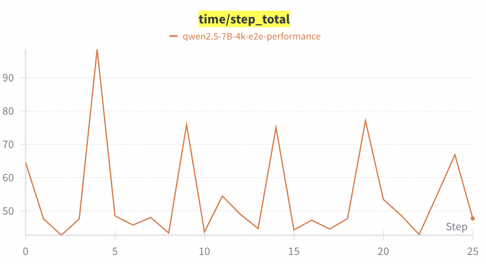
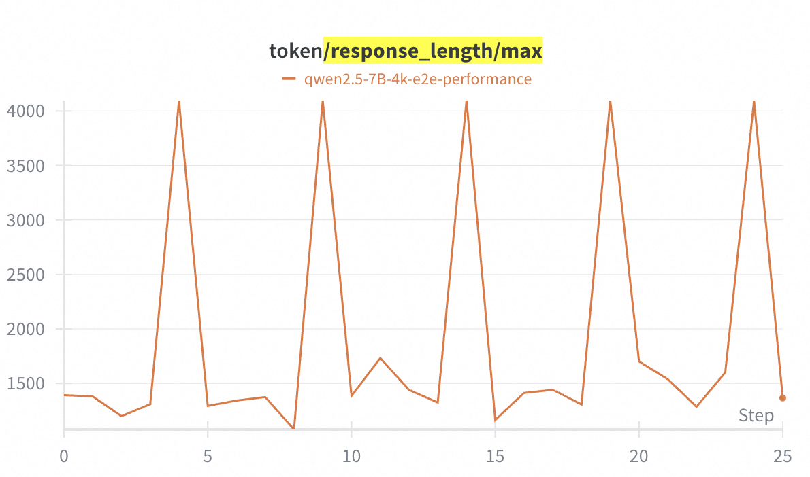
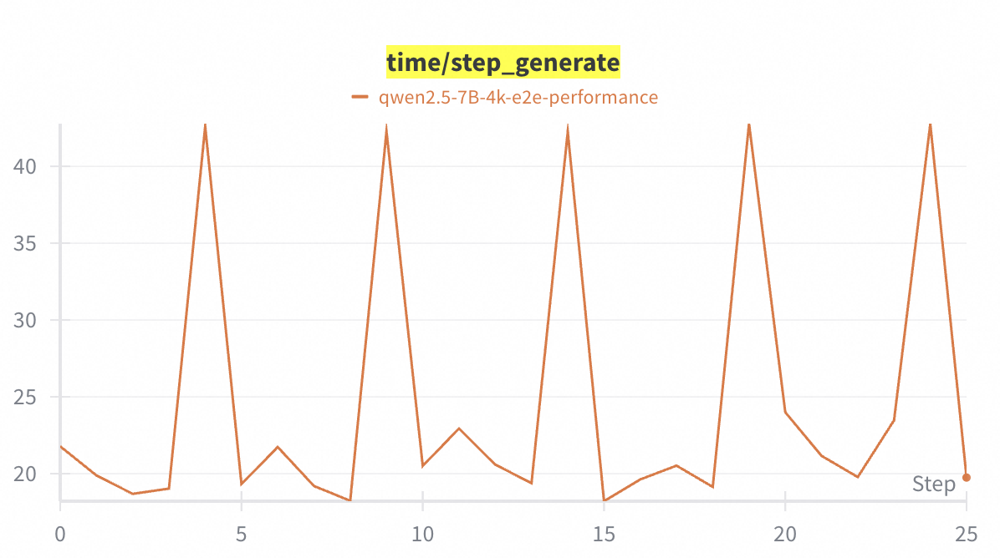
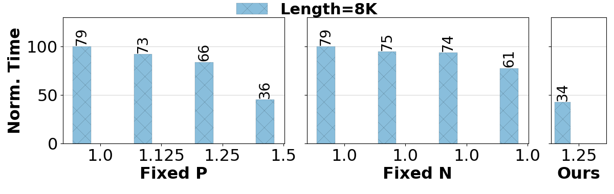
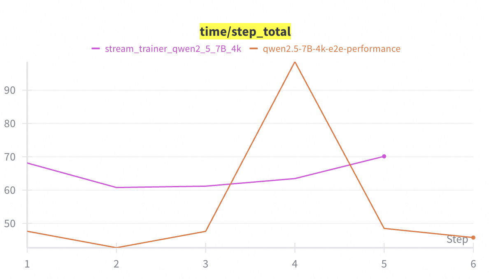

<div align="center">

<!--  -->

# RollPacker: Taming Long-Tail Rollouts for RL Post-Training with Tail Batching

Artifact Evaluation Guidelines for NSDI'26 [Paper](./files/nsdi26fall-paper677.pdf)

</div>

## Testbed Environment and Experiments Description
We provide you with scripts and configurations to reproduce key results in our paper, including:
- End-to-end evaluation results in Figure 9(a) and Figure 10 (Qwen2.5-7B version with 4K response length).
- Sensitivity analysis in Figure 11.
- Micro-benchmarks in Figure 13(b with Qwen2.5-7B), Figure 13(c) and Table 3.

*Note 1*: The evaluation results shown in the paper were conducted on NVIDIA H800 clusters with 16-128 GPUs.
Providing such infrastructure is extremely expensive, so we only provide you with resources of *eight A800/A100 GPUs* to train a **Qwen2.5-7B** model with 4-8K response length. As for a smaller scale, the absolute performance will not be an exact match, but they provide approximately the same trends.

*Note 2*: As running instances continuously is expensive, we will start them on demand. If you would like to use these instances, please email us (yzhaoep@cse.ust.hk) or reply on the HotCRP  discussion thread, and we will start them upon your request and give you corresponding access. Due to the timezone difference, requests between **11:00-23:00 (UTC+8)** will typically be answered immediately; requests outside this window will be handled **as soon as possible the next day**. Thank you for your understanding.

*Note 3*: Experiments that are **NOT** provided:
- End-to-end training in Figure 8, which allows to train for more than 80 iterations and will cost a large amount of GPU time.
- Micro-benchmarks in Figure 12, as well as the large-scale analysis in Figure 14, are not provided, since they require larger model sizes and more resources.
- Other experiment results which requires a 14B or 32B model.

Although we do not provide resources for these experiments, reviewers with access to large-scale resources may replicate these experiments.


## Environment Setup

### Option #1: Use Public Docker image.
```bash
mkdir -p ./infra/
cd ./infra
git clone git@github.com:Farrrrland/RollPacker.git
cd ..

docker pull hiyouga/verl:ngc-th2.6.0-cu126-vllm0.8.4-flashinfer0.2.2-cxx11abi0
docker run --rm -it \
  --gpus all \
  -v ./infra:/root/code \
  --workdir /root/code \
  hiyouga/verl:ngc-th2.6.0-cu126-vllm0.8.4-flashinfer0.2.2-cxx11abi0 \
  /bin/bash
```
You will find the source code located in `/root/code/RollPacker` of the Docker image.
After accessing the container, run
```bash
cd /root/code/RollPacker
bash install.sh
```

### Option #2: Build your own environment based on ROLL.
`RollPacker` is build on [ROLL](https://github.com/alibaba/ROLL). So you can follow ROLL's [set up instructions](https://github.com/alibaba/ROLL?tab=readme-ov-file#-get-started) to build your own environment for the **RLVR Pipeline**.

## Get Start
- Install necessary python packages and wait for several minutes to complete.
    ```bash
    bash install.sh
    ```

## Recommanded Configurations
To visualize full metrics, we recommand you to use your [Weights&Biases](https://wandb.ai/) account (which is free to register) and add your configurations in each `yaml` as following:

```yaml
track_with: wandb
tracker_kwargs:
  api_key: your-wandb-api-key
  project: your-project-name
  name: qwen2.5-7B-4k-e2e-performance
  notes: end-to-end RollPacker
  tags:
    - RollPacker
    - Math
```
You can also use tensorboard if you prefer to do so.

## Run Experiments
- End-to-end Evaluation (Figure 8(a)-optional, 9(a), 10).
    ```bash
    bash examples/e2e_performance/run_pipe.sh
    ```
    By default, this pipeline runs for **25 iterations** for illustration and use math data for training, you may run more steps to reproduce the reported validation score in Figure 8(a) if you have available resources in your own domain.

    If you collect metrics with W&B or tensorboard, you may search for the following metrics to reproduce the evaluations in our paper.
    
    - Figure 9(a) corresponds with `time/step_total`.
        
    - Figure 10(a) corresponds with `token/response_length/max`.
        
    - Figure 10(b) corresponds with `time/step_generate`.
        

- Sensitivity Analysis (Figure 11).
    ```bash
    bash examples/sensitive_analysis_fig11/run_8k.sh
    ```
    This example will only invoke the rollout stage without actually train the model, since the sensitive analysis in Figure 11 only consider rollout time with different *P* and *R*

    After finish execution, you may run the following:
    ```bash
    cd ./plot
    python plt_sensitive_squeezer.py
    ```
    You may find the visualized result as illustrated in figure 11 in `./plot/img/prompt_suqeezer_diff_config.png`.
    

- Micro-benchmarks of Reward Scheduler (Figure 13(b-c)).

    Figure 13 (b) **without** pipeline execution:
    ```bash
    bash examples/benchmark_fig13/run_7B_nopipeline.sh 
    ```

    Figure 13 (b) **with** pipeline execution:
    ```bash
    bash examples/benchmark_fig13/run_7B_pipeline.sh
    ```

    Figure 13 (c) **without** adaptive timeout:
    ```bash
    bash examples/benchmark_fig13/run_7B_adpt_notimeout.sh
    ```

    Figure 13 (c) **with** adaptive timeout:
    ```bash
    bash examples/benchmark_fig13/run_7B_adpt_timeout.sh   
    ```

- Stream Trainer (Table 3).
    ```bash
    bash examples/stream_trainer_table3/run_stream_trainer.sh
    ```
    This example provides a fixed setting of `infer_scaling_down_progress_ratio=0.40` and `scaling_down_train_batch_size=64` **w/o tail batching**, you may compare the performance with the **Long Rounds** in end-to-end performance.
    The iteration repeats for **5 times** by default.

    You may compare the step time with previous end-to-end metrics without enabling the stream traine.
    Since tail batching is not enabled in this run, you should compare the average step time with the **Long Rounds** (e.g., global_step=4) in the end-to-end metric.
    
    Note that you can skip the overhead of the first step since it incurres plently initialization overhead with will be armortized with over 100 steps of the total training pipeline.

